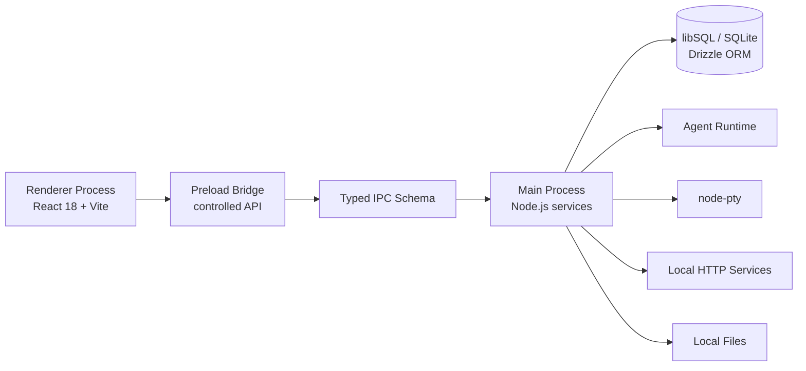

<h1 align="center">IPO Workbench</h1>

<p align="center">
  <strong>A local-first desktop workbench for AI agents, knowledge management, reading, coding, and remote control.</strong>
</p>

<p align="center">
  
  <a href="LICENSE"></a>
  
  
  
  
</p>

<p align="center">
  <a href="#why-ipo-workbench">Why</a> ·
  <a href="#features">Features</a> ·
  <a href="#quick-start">Quick Start</a> ·
  <a href="#documentation">Documentation</a> ·
  <a href="#development">Development</a>
</p>

---

## Why IPO Workbench

AI work today is split across too many surfaces: a chat client for asking, a notes app for saving, a reader for documents, a terminal for execution, a browser for collection, and separate tools for remote control or automation.

**IPO Workbench brings those surfaces into one desktop application.** It is designed as a local-first AI workspace where an agent can reason, use tools, work with files, search and organize knowledge, run commands, preview artifacts, and hand results back into the same environment.

The project is especially useful when you want:

- a desktop AI assistant that can do more than chat;
- a personal knowledge base that stays close to your local files and database;
- a reading workflow that turns documents, highlights, and notes into reusable knowledge;
- a coding workspace with file operations, terminal sessions, previews, and Git worktrees;
- a remote-control layer for continuing AI or terminal sessions from external channels;
- a codebase where Electron, React, IPC, local services, and AI runtime are organized as explicit engineering boundaries.

## Features

### AI Agent workspace

The right-side Copilot panel is backed by an Agent SDK runtime in the Electron main process. It coordinates model calls, tool-use events, permissions, follow-up messages, session lifecycle, memory snapshots, MCP integration, and UI streaming.

Key capabilities:

- start, abort, continue, and inspect agent runs;
- resolve tool permissions and interactive questions through the UI;
- transform tool-use events into readable cards;
- connect agent output with files, artifacts, knowledge, terminal, and preview surfaces;
- support sub-agent and multi-agent style workflows where configured.

Read more: [Agent System](docs/handbook/agent-system.md)

### Knowledge management

IPO Workbench includes a local knowledge layer for collecting, organizing, searching, and reusing information.

Core concepts:

- **Sources** for imported web pages, pasted content, and local files;
- **Notes** for markdown-first writing and knowledge capture;
- **Folders / projects** for organization;
- **Chunks, full-text search, and embeddings** for retrieval;
- **Wiki pages and graph views** for structured knowledge exploration;
- **Knowledge cards** for active recall and review workflows.

Read more: [Knowledge Base and Reader](docs/handbook/knowledge-reader.md)

### Reader

The reader turns long-form documents into an interactive learning and knowledge-capture surface.

Supported extensions are kept in sync with the reader frontend/backend format registry and currently include:

- PDF: `.pdf`
- EPUB: `.epub`
- Kindle / e-book formats: `.mobi`, `.azw`, `.azw3`, `.kfx`
- Text: `.txt`, `.log`
- HTML: `.html`, `.htm`, `.xhtml`
- Markdown: `.md`, `.markdown`
- Word: `.docx`
- Comic archive: `.cbz`

Reader workflows include import, chapter loading, progress saving, in-book search, global search, highlights, bookmarks, reading sessions, highlight export, and card generation.

Read more: [Knowledge Base and Reader](docs/handbook/knowledge-reader.md)

### Code sandbox, terminal, and preview

The central workspace provides a hands-on execution layer for users and agents.

It combines:

- safe file operations through audited IPC handlers;
- Monaco-based editing;
- xterm.js terminal sessions backed by `node-pty`;
- preview server management for frontend/static artifacts;
- execution graph visualization;
- Git worktree operations for isolated development.

Read more: [Sandbox, Terminal, and Preview](docs/handbook/sandbox-terminal.md)

### Remote control

Remote control lets external channels bridge into desktop agent and terminal workflows.

Configured channel families include:

- Feishu / Lark;
- Telegram;
- Slack;
- Discord;
- QQ Bot;
- WeChat;
- Generic Webhook.

The remote-control model is built around channel configuration, pairing, scoped permissions, event logs, remote sessions, and explicit controls for remote terminal lifecycle.

Read more: [Remote Control](docs/handbook/remote-control.md)

### TTS and desktop mascot

IPO Workbench also includes a multimedia interaction layer:

- TTS settings, voice listing, preview, cloning, deletion, capability detection, sync synthesis, streaming synthesis, cancellation, and testing;
- a desktop pet window at the `#/pet` renderer route;
- pet focus bridge, quick-reply bridge, drag/snap behavior, do-not-disturb controls, size/dwell presets, global shortcut settings, and custom mascot packages.

Read more: [TTS and Desktop Mascot](docs/handbook/tts-mascot.md)

### Backup and sync

The project includes local backup and WebDAV-oriented sync capabilities. These are exposed through IPC handlers and background services so that local-first data can still be backed up to user-controlled storage.

Read more: [Build and Release](docs/handbook/build-release.md)

## Architecture at a glance

IPO Workbench follows the Electron multi-process model and treats IPC as a first-class engineering boundary.



Important source locations:

| Area | Path |
|---|---|
| Renderer entry | [`src/main.tsx`](src/main.tsx) |
| Main UI shell | [`src/App.tsx`](src/App.tsx) |
| Main process entry | [`electron/main/index.ts`](electron/main/index.ts) |
| App lifecycle | [`electron/main/app-lifecycle.ts`](electron/main/app-lifecycle.ts) |
| IPC schema | [`electron/shared/ipc-schema.ts`](electron/shared/ipc-schema.ts) |
| IPC registration | [`electron/main/ipc/register.ts`](electron/main/ipc/register.ts) |
| IPC handlers | [`electron/main/ipc/handlers/`](electron/main/ipc/handlers/) |
| Build config | [`vite.config.ts`](vite.config.ts), [`electron-builder.json5`](electron-builder.json5) |

Read more: [System Architecture](docs/handbook/architecture.md) and [API and IPC](docs/handbook/api-and-ipc.md)

## Tech stack

| Layer | Technology |
|---|---|
| Desktop runtime | Electron 40 |
| Renderer | React 18, TypeScript 5.9, Vite 7 |
| UI/editor/terminal | Monaco Editor, xterm.js, React Resizable Panels |
| Graph and flows | `@xyflow/react`, D3 modules, Mermaid |
| Database | libSQL client, Drizzle ORM |
| Local services | Express, WebSocket, HTTP proxy middleware |
| Reader and parsing | React PDF, pdf-parse, Mammoth, Mozilla Readability, jsdom |
| Terminal backend | node-pty |
| Sync and backup | WebDAV |
| Packaging | Vite Electron plugin, Electron Builder |
| Quality tools | TypeScript, Biome |

## Quick Start

### Prerequisites

- Node.js compatible with the current Electron/Vite toolchain.
- npm.
- Platform-specific native build prerequisites for Electron native modules such as `node-pty`.

### Install

```bash
npm install
```

`postinstall` rebuilds `node-pty` for Electron and copies PDF.js assets:

```bash
npx @electron/rebuild -m . -w node-pty
node scripts/copy-pdfjs-assets.mjs
```

### Start development mode

```bash
npm run dev
```

The dev command runs Vite with the Electron plugin. The `predev` script prepares PDF.js assets and cleans the development build output first.

### Type-check and lint

```bash
npm run typecheck
npm run lint
```

### Build installers

```bash
npm run build
```

Platform-specific builds:

```bash
npm run build:mac
npm run build:win
npm run build:all
```

Read more: [Quick Start](docs/handbook/quick-start.md) and [Build and Release](docs/handbook/build-release.md)

## Documentation

The documentation is intentionally nested. The README is the front door; the handbook is the detailed map.

### Handbook

| Document | What it covers |
|---|---|
| [Project Overview](docs/handbook/project-overview.md) | Product positioning, users, scenarios, and boundaries |
| [System Architecture](docs/handbook/architecture.md) | Process model, startup lifecycle, IPC, data and service layers |
| [Feature Overview](docs/handbook/features.md) | Full feature map across agent, knowledge, reader, sandbox, remote control, TTS, and mascot |
| [Quick Start](docs/handbook/quick-start.md) | Setup, install, development startup, first configuration |
| [Development Guide](docs/handbook/development.md) | Directory conventions, IPC extension, UI work, database, checks |
| [Agent System](docs/handbook/agent-system.md) | Agent runtime, permissions, tools, memory, MCP, sub-agents |
| [Knowledge Base and Reader](docs/handbook/knowledge-reader.md) | Sources, notes, wiki, cards, reader, highlights, search |
| [Sandbox, Terminal, and Preview](docs/handbook/sandbox-terminal.md) | Managed workspace, safe files, Monaco, xterm, preview server, worktree |
| [Remote Control](docs/handbook/remote-control.md) | IM channels, pairing, scopes, sessions, remote terminal |
| [TTS and Desktop Mascot](docs/handbook/tts-mascot.md) | TTS providers, synthesis, pet window, mascot packages |
| [API and IPC](docs/handbook/api-and-ipc.md) | IPC contract, handler patterns, command categories, safety notes |
| [Build and Release](docs/handbook/build-release.md) | Scripts, Vite/Electron Builder, native modules, release checklist |
| [Documentation Map](docs/handbook/documentation-map.md) | How root docs, handbook pages, and historical docs fit together |

### Root references

| Document | Purpose |
|---|---|
| [ARCHITECTURE.md](ARCHITECTURE.md) | Existing architecture reference |
| [API.md](API.md) | Existing API and IPC reference |
| [FEATURES.md](FEATURES.md) | Existing long-form feature reference |
| [DEVELOPMENT.md](DEVELOPMENT.md) | Existing development reference |

## Development

Common scripts from `package.json`:

| Command | Purpose |
|---|---|
| `npm run dev` | Start Vite/Electron development mode |
| `npm run typecheck` | Run TypeScript checking without emitting files |
| `npm run lint` | Run Biome checks |
| `npm run format` | Format source/config files with Biome |
| `npm run build` | Prepare assets, type-check, build renderer/main, package with Electron Builder |
| `npm run build:mac` | Build macOS artifacts |
| `npm run build:win` | Verify Windows native binaries and build Windows NSIS installer |
| `npm run build:all` | Build macOS and Windows artifacts |

Recommended development flow:

1. Read [Project Overview](docs/handbook/project-overview.md) to understand the product shape.
2. Read [System Architecture](docs/handbook/architecture.md) before changing cross-process behavior.
3. Read [API and IPC](docs/handbook/api-and-ipc.md) before adding IPC commands.
4. Use [Development Guide](docs/handbook/development.md) for conventions and extension patterns.
5. Run `npm run typecheck` and `npm run lint` before submitting changes.

## Project structure

```text
.
├── electron/                  # Electron main/preload/shared code
│   ├── main/                  # Main process services, IPC, windows, database, runtime modules
│   └── shared/                # Shared contracts such as IPC schema
├── src/                       # React renderer application
│   ├── bootstrap/             # Main app and pet app bootstrapping
│   ├── components/            # UI components
│   ├── lib/                   # Renderer-side adapters and domain utilities
│   └── ...
├── docs/                      # Existing docs, research notes, construction docs, API notes
│   └── handbook/              # Structured documentation handbook
├── scripts/                   # Build, asset, verification, and maintenance scripts
├── ARCHITECTURE.md            # Root architecture reference
├── API.md                     # Root API reference
├── FEATURES.md                # Root feature reference
├── DEVELOPMENT.md             # Root development reference
├── electron-builder.json5     # Packaging configuration
├── vite.config.ts             # Vite and Electron build configuration
└── package.json               # Scripts, dependencies, package metadata
```

## Design principles

- **Local-first by default**: local database, local files, local settings, optional user-controlled sync.
- **Explicit boundaries**: renderer UI talks to main-process capabilities through typed IPC, not direct privileged access.
- **Tool use should be auditable**: agent actions, file operations, terminal execution, and remote control should remain visible and controllable.
- **Documentation should be layered**: keep README readable, put deep module details into the handbook, and preserve historical docs as references.
- **Do not overpromise integration maturity**: external channels, providers, and native modules depend on platform credentials, local environment, and packaging constraints.

## Status notes

This repository is actively evolving. Some older documents under `docs/` are historical design or construction notes and may describe earlier implementation plans. When there is a conflict, prefer the current source code, `package.json`, and the structured handbook.

## License

Licensed under the [Apache License 2.0](LICENSE).
