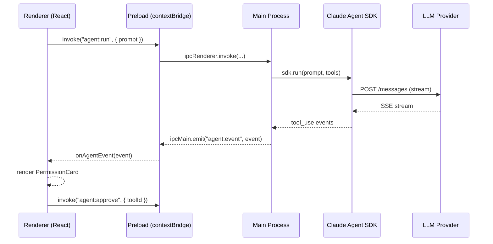

<p align="center">
  
  <!-- TODO: Add logo asset -->
</p>

<h1 align="center">IPO Workbench</h1>

<p align="center">
  <strong>The open-source AI workbench that puts your knowledge and privacy first.</strong>
  <br/>
  <sub>A full-featured desktop AI workspace powered by the Anthropic Claude Agent SDK — built for developers, researchers, and knowledge workers who refuse to compromise.</sub>
</p>

<p align="center">
  <a href="https://github.com/YOUR_ORG/ipo-workbench/releases/latest">
    
  </a>
  <a href="LICENSE">
    
  </a>
  
  
  
  
  
  <a href="https://github.com/YOUR_ORG/ipo-workbench/commits/main">
    
  </a>
  <a href="https://github.com/YOUR_ORG/ipo-workbench/pulls">
    
  </a>
  <a href="https://github.com/YOUR_ORG/ipo-workbench/issues">
    
  </a>
  <a href="https://github.com/YOUR_ORG/ipo-workbench/stargazers">
    
  </a>
</p>

<p align="center">
  <strong>English</strong> · <a href="README_zh.md">中文</a>
</p>

---

> **IPO Workbench** is a privacy-first, AI-native desktop knowledge workbench. It deeply integrates the Anthropic Claude Agent SDK — giving your AI assistant real tool-use capabilities, not just chat. Every byte of your data lives locally. No telemetry. No cloud lock-in.
>
> - **AI that acts, not just talks** — The agent reads/writes files, runs terminal commands, searches the web, and manages your knowledge base through structured tool calls with your explicit approval.
> - **A complete knowledge loop** — From document ingestion to full-text search, semantic retrieval, flashcards, wiki graphs, and e-book reading, all unified in one warm, refined interface.
> - **Built for power users** — Monaco editor, xterm.js terminal, Git worktree management, 20+ slash commands, MCP server support, and multi-platform remote control.
> - **Your data, your rules** — libSQL/SQLite on-device storage, no telemetry, WebDAV backup to any cloud you control.

---

## Table of Contents

- [Why IPO Workbench](#why-ipo-workbench)
- [Key Features](#key-features)
- [Supported LLM Providers](#supported-llm-providers)
- [Architecture](#architecture)
- [Screenshots](#screenshots)
- [Quick Start](#quick-start)
- [Build](#build)
- [Project Structure](#project-structure)
- [Roadmap](#roadmap)
- [Contributing](#contributing)
- [Community](#community)
- [Documentation](#documentation)
- [Acknowledgements](#acknowledgements)
- [License](#license)
- [Disclaimer](#disclaimer)

---

## Why IPO Workbench

The AI tooling landscape is fragmented. Chat clients give you conversation but no workspace. Coding agents give you code but no knowledge. Note-taking apps give you storage but no intelligence. Cloud products give you convenience but take your data.

**IPO Workbench is built on the premise that these capabilities belong together — locally.**

| | IPO Workbench | Cherry Studio | Cursor | Notion AI |
|---|:---:|:---:|:---:|:---:|
| Local-first storage | ✅ | ✅ | ✅ | ❌ |
| Claude Agent SDK (tool-use) | ✅ | ❌ | Partial | ❌ |
| Interactive permission system | ✅ | ❌ | ❌ | ❌ |
| Built-in e-book reader | ✅ | ❌ | ❌ | ❌ |
| Knowledge graph (wiki) | ✅ | ❌ | ❌ | ✅ |
| Spaced repetition (SRS cards) | ✅ | ❌ | ❌ | ❌ |
| Terminal + Monaco editor | ✅ | ❌ | ✅ | ❌ |
| Multi-platform remote control | ✅ | ❌ | ❌ | ❌ |
| MCP server management | ✅ | Partial | ✅ | ❌ |
| Zero telemetry | ✅ | ✅ | ❌ | ❌ |

---

## Key Features

### AI Agent (Copilot)

The right-panel AI assistant, powered end-to-end by the Claude Agent SDK.

- **Real Tool Use** — The agent reads/writes files, runs shell commands, searches the web, manages your knowledge base, generates images, and calls MCP tools — all through structured, auditable tool calls.
- **Interactive Permission System** — Every tool invocation surfaces a permission card. Configure per-category modes: `ask` / `auto-allow` / `deny`. You are always in control.
- **Plan Mode** — Toggle plan mode for the agent to reason step-by-step and present a plan before executing.
- **20+ Slash Commands** — `/compact`, `/init`, `/review`, `/help`, `/cost`, `/agents`, `/permissions`, `/export`, `/doctor`, and more.
- **Multi-Agent Collaboration** — Sub-agent and teammate patterns for parallelizing complex tasks.
- **Session Persistence** — Conversation history, checkpoint save/restore, and cross-session memory.
- **Agent Memory** — A persistent long-term memory system; the agent remembers context across sessions.

### Knowledge Management

A complete knowledge lifecycle from ingestion to recall.

- **Sources** — Import from URLs, local files, or direct paste with automatic content extraction and chunking.
- **Full-Text Search** — FTS5-powered search across your entire knowledge base, millisecond latency.
- **Semantic Search** — Embedding-based chunk retrieval for meaning-aware queries.
- **Folders & Organization** — Hierarchical folder structure with drag-and-drop.
- **Notes** — Markdown-first note-taking tightly integrated with the knowledge graph.
- **Knowledge Cards** — A spaced-repetition (SRS) flashcard system for active recall and retention.

### E-Book Reader

A focused, distraction-free reading environment.

- **Format Support** — PDF, EPUB, MOBI, AZW3, TXT, HTML, Markdown, DOCX, CBZ.
- **Highlights & Annotations** — Create, manage, and export highlights with inline notes.
- **Bookmarks & Progress** — Automatic progress tracking, bookmarks, and reading time stats.
- **In-Book Full-Text Search** — Instantly locate any passage within any book.
- **Card Generation** — Convert highlights directly into SRS flashcards without leaving the reader.

### Code Sandbox (Managed Workspace)

A managed, AI-assisted coding environment in the center panel.

- **Full Terminal** — xterm.js terminal with node-pty backend. Real shell, not a fake REPL.
- **Monaco Editor** — The same editor that powers VS Code, embedded natively.
- **Safe File Operations** — Read, write, list, mkdir, copy, move, delete — all via audited IPC handlers.
- **Execution Graph** — Visual execution flow powered by `@xyflow/react`.
- **Preview Server** — Built-in dev server for instant frontend project preview.
- **Git Worktree** — Isolated git worktree management for parallel, non-destructive development.

### Wiki & Knowledge Graph

Visual, interconnected knowledge exploration.

- **Wiki Pages** — Create and edit pages with rich, structured content.
- **Interactive Graph** — D3 + XYFlow-powered force-directed graph of knowledge relationships. Zoom, pan, drag.
- **AI-Assisted Generation** — The agent can draft wiki pages from your source documents automatically.

### Text-to-Speech (TTS)

Multi-provider, high-quality voice synthesis.

- **6 Providers** — System TTS, OpenAI-compatible, ElevenLabs, Volcano Engine, MiMo, and custom endpoints.
- **Streaming Synthesis** — Real-time audio output with low latency.
- **Voice Cloning** — Clone custom voices from audio samples.
- **Pet Integration** — The desktop mascot speaks synthesized text with animated speech bubbles.

### Desktop Mascot

An animated, AI-aware desktop companion.

- **Multi-State Animations** — Idle, thinking, greet, done, sad, sleepy, and more.
- **Mouse Gaze** — The mascot follows your cursor with natural eye movement.
- **TTS Speech Bubbles** — The mascot speaks agent responses aloud.
- **Global Hotkey** — `Ctrl+Alt+Space` to summon the mascot from anywhere.
- **Custom Mascot Packs** — Import community-created packs via the `mascot://` deep-link protocol.

### Remote Control

Control IPO Workbench from your phone or any messaging platform.

- **Supported Platforms** — Feishu/Lark, Telegram, Slack, Discord, QQ Bot, WeChat (experimental).
- **Secure Pairing** — Cryptographic device pairing with an approval workflow.
- **Agent Binding** — Bind an AI agent session to a remote channel for interactive back-and-forth.

### More

- **Built-in Browser** — Embedded browser panel with one-click content clipping and Exa MCP search integration.
- **AI Image Generation** — Multi-provider image generation (DALL-E, Stable Diffusion, and more).
- **Skills Marketplace** — Discover, install, and manage agent skills from community mirrors.
- **MCP Server Management** — Configure and manage Model Context Protocol servers from the settings panel.
- **Command Palette** — `Cmd/Ctrl+K` for instant access to any command or action.
- **WebDAV Backup & Sync** — Scheduled automatic backups to any WebDAV-compatible cloud storage.
- **Light / Dark Mode** — Full theme support with the warm-tone B.AI design system.
- **Artifact Management** — Versioned storage for all AI-generated outputs.

---

## Supported LLM Providers

IPO Workbench ships a multi-provider LLM abstraction layer. Configure any combination of providers in **Settings → AI & Models → Providers**.

| Provider | Type | Notes |
|---|---|---|
| **Anthropic** | Cloud API | Claude 3.5 / 3 / Haiku family; also the Agent SDK backbone |
| **OpenAI** | Cloud API | GPT-4o, GPT-4 Turbo, o1, o3, and all compatible variants |
| **DeepSeek** | Cloud API | DeepSeek-V3, DeepSeek-R1 |
| **Google Gemini** | Cloud API | Gemini 1.5 Pro / Flash, Gemini 2.0 |
| **Ollama** | Local inference | Any model hosted by a local Ollama instance |
| **Dify** | Platform API | Dify-hosted workflows and LLM endpoints |
| **Custom (OpenAI-compatible)** | Any | Any provider exposing an OpenAI-compatible `/chat/completions` endpoint |

---

## Architecture

IPO Workbench follows the standard Electron three-process model with two embedded local HTTP services.

```
┌─────────────────────────────────────────────────────────────────────┐
│                         Electron Application                        │
│                                                                     │
│  ┌─────────────────────┐        ┌──────────────────────────────┐   │
│  │   Main Process      │        │      Renderer Process        │   │
│  │   (Node.js)         │◄──────►│      (React 18 + Vite)       │   │
│  │                     │  IPC   │                              │   │
│  │  • app-lifecycle    │        │  • Three-panel layout shell  │   │
│  │  • libSQL / Drizzle │        │  • AI Copilot sidebar        │   │
│  │  • IPC register     │        │  • Knowledge management UI   │   │
│  │    (~150+ commands) │        │  • E-book reader overlay     │   │
│  │  • LLM layer        │        │  • Wiki & graph views        │   │
│  │  • Knowledge base   │        │  • Terminal (xterm.js)       │   │
│  │    (FTS5 + vectors) │        │  • Monaco editor             │   │
│  │  • Remote control   │        │  • Settings (5 categories)   │   │
│  │  • Skills market    │        │  • Command palette           │   │
│  │  • TTS engine       │        │  • Desktop mascot sub-app    │   │
│  │  • Winston logging  │        │                              │   │
│  └──────────┬──────────┘        └──────────────────────────────┘   │
│             │                                                       │
│  ┌──────────┴──────────┐        ┌──────────────────────────────┐   │
│  │   Preload Script    │        │     Local HTTP Services      │   │
│  │   (contextBridge)   │        │                              │   │
│  │                     │        │  • Anthropic-compatible proxy │   │
│  │  window.electronAPI │        │    127.0.0.1:8765+           │   │
│  │                     │        │                              │   │
│  └─────────────────────┘        │  • Clip HTTP service         │   │
│                                 │    127.0.0.1:21064+          │   │
│                                 └──────────────────────────────┘   │
└─────────────────────────────────────────────────────────────────────┘

  Data at rest: userData/db.sqlite  (libSQL/SQLite, FTS5)
  IPC contract: electron/shared/ipc-schema.ts  (single source of truth)
```

**Key architectural decisions:**

- **`electron/shared/ipc-schema.ts`** is the single source of truth for all IPC types (~3200 lines). Main process, preload, and renderer all import from here.
- **Anthropic proxy** (`8765+`) allows the Claude Agent SDK to stream through a local endpoint without leaking API keys to the renderer process.
- **Clip HTTP service** (`21064+`) handles web content clipping from the embedded browser.
- **Port discovery** uses `+N` probing (10 slots) to avoid conflicts with other local services.



---

## Screenshots

> Screenshots are coming soon. Contributions of quality screenshots are welcome — see [Contributing](#contributing).

| Three-Panel Layout | AI Copilot | E-Book Reader |
|:---:|:---:|:---:|
| *(TODO)* | *(TODO)* | *(TODO)* |

| Knowledge Graph | Desktop Mascot | Settings |
|:---:|:---:|:---:|
| *(TODO)* | *(TODO)* | *(TODO)* |

---

## Quick Start

### Prerequisites

| Requirement | Version |
|---|---|
| Node.js | >= 18 |
| npm | >= 9 |
| Git | any recent |
| macOS / Windows | macOS 12+ or Windows 10+ |

### Install & Run

```bash
# 1. Clone the repository
git clone https://github.com/YOUR_ORG/ipo-workbench.git
cd ipo-workbench

# 2. Install dependencies
#    postinstall automatically: rebuilds node-pty native module
#                               copies PDF.js worker assets
npm install

# 3. Start in development mode (Vite + Electron HMR)
npm run dev
```

### Configure Your First AI Provider

1. Open **Settings** with `Cmd+,` (macOS) or `Ctrl+,` (Windows)
2. Navigate to **AI & Models → Providers & Models**
3. Add your API key for Anthropic, OpenAI, DeepSeek, or any compatible provider
4. Set a default model under **Default Model Assignment**
5. Start a conversation in the **Copilot** sidebar

---

## Build

```bash
# macOS (produces .dmg)
npm run build:mac

# Windows (produces .exe / NSIS installer)
npm run build:win

# Both platforms
npm run build:all
```

Build artifacts are output to the `release/` directory.

### All Available Scripts

```bash
npm run dev          # Start dev server (Vite + Electron HMR)
npm run build        # Full production build (tsc → vite → electron-builder)
npm run build:mac    # macOS build only
npm run build:win    # Windows build only
npm run typecheck    # TypeScript type check (no emit)
npm run lint         # Biome check
npm run format       # Biome format (auto-fix)
npm run postinstall  # Rebuild native modules + copy assets
```

---

## Project Structure

```
ipo-workbench/
├── electron/
│   ├── main/
│   │   ├── index.ts                  # Main process entry point
│   │   ├── app-lifecycle.ts          # Startup chain: db → IPC → window → services
│   │   ├── db/                       # libSQL + Drizzle ORM, migrations
│   │   ├── ipc/
│   │   │   ├── register.ts           # Central IPC registration (~150+ commands)
│   │   │   └── handlers/             # Domain handlers (49 files)
│   │   ├── llm/                      # Multi-provider LLM abstraction layer
│   │   ├── http/                     # Embedded HTTP: Anthropic proxy + Clip service
│   │   ├── kb/                       # Knowledge base: FTS5 + vector embeddings
│   │   ├── reader/                   # E-book parsers (epub/pdf) + SRS scheduler
│   │   ├── services/                 # 21 backend services
│   │   ├── remote-control/           # IM platform integrations
│   │   ├── skills-marketplace/       # Agent skill marketplace client
│   │   ├── tts/                      # Multi-provider TTS engine
│   │   ├── storage/                  # Vault / file storage abstraction
│   │   ├── logging/                  # Winston logger
│   │   └── windows/                  # BrowserWindow factory
│   ├── preload/
│   │   └── index.ts                  # contextBridge → window.electronAPI
│   └── shared/
│       ├── ipc-schema.ts             # IPC type contract (~3200 lines, single source of truth)
│       └── preload-api.ts            # Preload API interface
│
├── src/                              # React renderer process
│   ├── main.tsx                      # Entry: hash-based routing (main app / pet)
│   ├── App.tsx                       # Three-panel layout shell
│   ├── index.css                     # Global styles + B.AI design tokens
│   ├── components/
│   │   ├── layout/                   # PanelShell, ResizeHandle, SidebarRail
│   │   ├── resource/                 # Left sidebar views (sources, notes, cards…)
│   │   ├── sandbox/                  # Center panel: managed workspace + execution graph
│   │   ├── wiki/                     # Wiki editor, generator, knowledge graph
│   │   ├── Terminal/                 # xterm.js terminal panel
│   │   ├── CopilotSidebar.tsx        # Right panel: AI chat
│   │   ├── chat/                     # Chat messages, input, tool call display
│   │   ├── agent/                    # Agent runtime UI (PermissionCard, PlanCard…)
│   │   ├── Settings/                 # 5-category, 21-subtab settings panel
│   │   ├── CommandPalette/           # Cmd+K command palette
│   │   ├── reader/                   # E-book reader overlay
│   │   ├── cards/                    # Knowledge card library
│   │   ├── skills/                   # Skill marketplace UI
│   │   ├── Mascot/                   # Desktop mascot onboarding + display
│   │   └── ui/                       # Base UI components (buttons, inputs…)
│   ├── lib/
│   │   ├── stores/                   # Custom store system (useSyncExternalStore)
│   │   ├── agent/                    # Agent SDK client, persistence, permissions
│   │   ├── api.ts                    # Business-level IPC wrappers
│   │   ├── tauriCompat.ts            # invoke<T>(cmd, args) — IPC bridge
│   │   ├── tauriEventCompat.ts       # listen<T>(event, cb) — event bridge
│   │   └── config.ts                 # Settings I/O
│   └── pet/                          # Desktop mascot sub-app (#/pet route)
│
├── docs/                             # 70+ documentation files
├── cloud-relay/                      # Cloud relay service (independent sub-project)
├── scripts/                          # Build and asset scripts
├── tailwind.config.js                # Tailwind + B.AI design tokens
├── biome.json                        # Biome formatter config
├── vite.config.ts                    # Vite + vite-plugin-electron config
└── package.json
```

---

## Roadmap

The following capabilities are planned or under active exploration. This list is subject to change.

- [ ] **Plugin / Extension API** — A stable, versioned public API for third-party extensions
- [ ] **iOS / Android Companion App** — View notes, cards, and chat on mobile; sync via WebDAV
- [ ] **Collaborative Editing** — Real-time multi-user wiki editing via CRDTs
- [ ] **Voice Input** — Whisper-based speech-to-text for hands-free agent interaction
- [ ] **Native Notifications** — OS-level notifications for agent completions and remote messages
- [ ] **Custom Themes** — Theme editor with design token export
- [ ] **Offline LLM First-Class Support** — Deeper Ollama integration with automatic model management
- [ ] **PDF Annotation Export** — Export PDF highlights to Markdown / Anki / Notion
- [ ] **Agent Skill Authoring UI** — Visual skill builder within the app, no code required
- [ ] **Windows Arm64** — Native Windows Arm build support

See [open issues](https://github.com/YOUR_ORG/ipo-workbench/issues) for feature requests and discussion.

---

## Contributing

We welcome contributions of all kinds: bug reports, feature requests, documentation improvements, and code.

### Getting Started

1. **Fork** the repository and create your branch from `main`.
2. **Install** dependencies with `npm install`.
3. **Make your changes**, keeping the following guidelines in mind.
4. **Open a Pull Request** against `main` with a clear description.

### Code Guidelines

- **Formatter**: This project uses [Biome](https://biomejs.dev/). Run `npm run format` before committing.
- **Type safety**: All code must be TypeScript. Run `npm run typecheck` — it must pass with zero errors.
- **IPC contract**: If you add or modify any IPC command, you **must** update all four locations simultaneously:
  1. `electron/shared/ipc-schema.ts` (type definition)
  2. `electron/main/ipc/handlers/*.ts` (implementation)
  3. `electron/main/ipc/register.ts` (registration)
  4. `src/lib/api.ts` or the relevant frontend call site
- **Decoupling**: Keep files focused. Avoid adding unrelated logic to existing large files. Prefer creating a new handler or service module.
- **No fake data**: All displayed data must have a real source. No lorem ipsum, no hardcoded demo content.
- **Dark mode**: All new UI components must work correctly in both light and dark mode.

### Pre-Commit Checklist

```
[ ] npm run typecheck   — passes with zero errors
[ ] npm run lint        — no unexpected errors
[ ] npm run format      — code is formatted
[ ] Tested in Electron  — not just a browser devtools check
[ ] IPC schema updated  — if any IPC was added or changed
[ ] Docs updated        — if behavior or interfaces changed
[ ] Settings panel      — checked whether new features need a settings entry
[ ] No unrelated files  — diff contains only intended changes
```

### Reporting Bugs

Please use [GitHub Issues](https://github.com/YOUR_ORG/ipo-workbench/issues) with the **bug** label. Include:
- IPO Workbench version
- OS and version
- Steps to reproduce
- Expected vs. actual behavior
- Relevant log output (logs are in `userData/logs/` in production)

---

## Community

- **GitHub Discussions** — [Discussions](https://github.com/YOUR_ORG/ipo-workbench/discussions) for questions, ideas, and show-and-tell
- **GitHub Issues** — [Issues](https://github.com/YOUR_ORG/ipo-workbench/issues) for bugs and feature requests
- **Discord** — *(coming soon)*

---

## Documentation

Detailed documentation lives in the [`docs/`](docs/) directory.

| Document | Description |
|---|---|
| [Interface API Reference](docs/接口文档.md) | Complete IPC and HTTP API reference |
| [WebDAV API](docs/webdav接口文档.md) | WebDAV backup/restore interface specification |
| [TTS API](docs/TTS接口文档.md) | TTS IPC interface documentation |
| [Reader API](docs/reader-api.md) | E-book reader IPC reference |
| [Claude SDK Integration](docs/Claude_sdk.md) | Claude Agent SDK integration reference |
| [UI Design Spec](docs/UI设计规范.md) | UI/UX design specifications and principles |
| [Frontend Design System](docs/frontend-design-system.md) | B.AI warm-tone design system documentation |
| [Slash Commands Reference](docs/slash-commands-reference.md) | All built-in slash command documentation |
| [Changelog](CHANGELOG.md) | Detailed development changelog |
| [Construction Log](docs/施工文档.md) | Implementation notes and engineering decisions |

---

## Acknowledgements

IPO Workbench is built on the shoulders of an extraordinary open-source ecosystem. We owe deep gratitude to every project listed here.

### Special Thanks

- **[Cherry Studio](https://github.com/CherryHQ/cherry-studio)** — Cherry Studio's elegant multi-model AI client design provided invaluable reference for our AI chat interface, provider management, and model selector patterns. Its thoughtful approach to UX significantly influenced how IPO Workbench handles multi-provider configuration and conversation management.

- **[Anthropic Claude Agent SDK](https://github.com/anthropics/claude-agent-sdk)** — The Agent SDK is the AI backbone of IPO Workbench. Its architecture for tool-use, interactive permissions, multi-agent collaboration, and streaming event processing enabled the deep, trust-worthy AI integration that defines this application. We are deeply grateful to the Anthropic team for building and open-sourcing this framework.

### Desktop & Runtime

| Project | Description |
|---|---|
| [Electron](https://www.electronjs.org/) | Cross-platform desktop application framework |
| [Vite](https://vite.dev/) | Next-generation frontend build tool |
| [vite-plugin-electron](https://github.com/electron-vite/vite-plugin-electron) | Vite integration for Electron development |

### Frontend

| Project | Description |
|---|---|
| [React](https://react.dev/) | UI component library |
| [TypeScript](https://www.typescriptlang.org/) | Typed JavaScript at scale |
| [Tailwind CSS](https://tailwindcss.com/) | Utility-first CSS framework |
| [TanStack Query](https://tanstack.com/query) | Asynchronous state management and data fetching |
| [TanStack Virtual](https://tanstack.com/virtual) | High-performance list and grid virtualization |

### UI & Icons

| Project | Description |
|---|---|
| [Lucide React](https://lucide.dev/) | Beautiful, consistent icon library |
| [react-resizable-panels](https://github.com/bvaughn/react-resizable-panels) | Resizable panel layouts |
| [class-variance-authority](https://cva.style/) | Component variant management |
| [tailwind-merge](https://github.com/dcastil/tailwind-merge) | Intelligently merge Tailwind class names |
| [clsx](https://github.com/lukeed/clsx) | Conditional class name construction |

### Editor & Terminal

| Project | Description |
|---|---|
| [Monaco Editor](https://microsoft.github.io/monaco-editor/) (`@monaco-editor/react`) | VS Code's editor, embedded as a React component |
| [xterm.js](https://xtermjs.org/) (`@xterm/xterm`) | Full-featured terminal emulator for the browser |
| [node-pty](https://github.com/microsoft/node-pty) | Fork pseudo-terminals in Node.js (Microsoft) |

### AI & LLM

| Project | Description |
|---|---|
| [@anthropic-ai/claude-agent-sdk](https://github.com/anthropics/claude-agent-sdk) | Anthropic's official Agent SDK — the AI core |

### Visualization

| Project | Description |
|---|---|
| [@xyflow/react](https://reactflow.dev/) | Node-based graph and flow diagram library |
| [D3](https://d3js.org/) (`d3-force`, `d3-drag`, `d3-selection`, `d3-zoom`) | Data-driven document visualization primitives |
| [Mermaid](https://mermaid.js.org/) | Diagram and chart generation from text |

### Database & Storage

| Project | Description |
|---|---|
| [libSQL](https://turso.tech/libsql) (`@libsql/client`) | Open-source SQLite fork with FTS5 support |
| [Drizzle ORM](https://orm.drizzle.team/) | Type-safe TypeScript ORM for SQL |
| [drizzle-kit](https://orm.drizzle.team/kit-docs/overview) | Drizzle migration toolkit |

### Document Processing

| Project | Description |
|---|---|
| [react-pdf](https://github.com/wojtekmaj/react-pdf) | PDF rendering in React |
| [pdf-parse](https://github.com/modesty/pdf-parse) | PDF text extraction |
| [mammoth](https://github.com/mwilliamson/mammoth.js) | DOCX to HTML/Markdown conversion |
| [@mozilla/readability](https://github.com/mozilla/readability) | Web article content extraction (Mozilla) |
| [node-stream-zip](https://github.com/antelle/node-stream-zip) | ZIP/EPUB/CBZ streaming extraction |

### Syntax & Markdown

| Project | Description |
|---|---|
| [Shiki](https://shiki.matsu.io/) | Beautiful, accurate syntax highlighting |
| [react-markdown](https://github.com/remarkjs/react-markdown) | Markdown rendering for React |
| [remark-gfm](https://github.com/remarkjs/remark-gfm) | GitHub Flavored Markdown support |
| [react-diff-viewer-continued](https://github.com/dev-bhanu/react-diff-viewer-continued) | Side-by-side diff rendering |
| [DOMPurify](https://github.com/cure53/DOMPurify) | XSS sanitization for HTML |

### IM & Remote Control

| Project | Description |
|---|---|
| [@larksuiteoapi/node-sdk](https://github.com/larksuite/node-sdk) | Feishu / Lark Bot SDK |
| [@slack/bolt](https://slack.dev/bolt-js/) | Slack application framework |
| [discord.js](https://discord.js.org/) | Discord bot and API client |
| [grammy](https://grammy.dev/) | Telegram Bot framework |

### HTTP & Network

| Project | Description |
|---|---|
| [Express 5](https://expressjs.com/) | Local HTTP server (Anthropic proxy + Clip service) |
| [http-proxy-middleware](https://github.com/chimurai/http-proxy-middleware) | HTTP proxying middleware |
| [webdav](https://github.com/perry-mitchell/webdav-client) | WebDAV client for backup and sync |
| [ws](https://github.com/websockets/ws) | WebSocket client and server |
| [cors](https://github.com/expressjs/cors) | CORS middleware for Express |
| [chokidar](https://github.com/paulmillr/chokidar) | File system watcher |

### Utilities

| Project | Description |
|---|---|
| [zod](https://zod.dev/) | TypeScript-first schema validation |
| [lz-string](https://github.com/pieroxy/lz-string) | LZ-based string compression |
| [archiver](https://github.com/archiverjs/node-archiver) | File archiving (zip, tar) |
| [sharp](https://sharp.pixelplumbing.com/) | High-performance image processing |
| [fs-extra](https://github.com/jprichardson/node-fs-extra) | Extra filesystem methods |
| [jsdom](https://github.com/jsdom/jsdom) | DOM environment for Node.js |
| [diff](https://github.com/kpdecker/jsdiff) | Text diffing library |
| [qrcode](https://github.com/soldair/node-qrcode) | QR code generation |
| [Winston](https://github.com/winstonjs/winston) | Universal logging library |

### Build & Quality

| Project | Description |
|---|---|
| [electron-builder](https://www.electron.build/) | Electron application packager and distributor |
| [Biome](https://biomejs.dev/) | Fast formatter and linter (replaces ESLint + Prettier) |
| [@electron/rebuild](https://github.com/electron/rebuild) | Rebuild native Node modules for Electron |
| [autoprefixer](https://github.com/postcss/autoprefixer) | CSS vendor prefix automation |
| [PostCSS](https://postcss.org/) | CSS transformation toolchain |

---

## License

This project is licensed under the **Apache License 2.0** — see the [LICENSE](LICENSE) file for details.

```
Copyright 2024-2026 IPO Workbench Contributors

Licensed under the Apache License, Version 2.0 (the "License");
you may not use this file except in compliance with the License.
You may obtain a copy of the License at

    http://www.apache.org/licenses/LICENSE-2.0

Unless required by applicable law or agreed to in writing, software
distributed under the License is distributed on an "AS IS" BASIS,
WITHOUT WARRANTIES OR CONDITIONS OF ANY KIND, either express or implied.
See the License for the specific language governing permissions and
limitations under the License.
```

---

## Disclaimer

**IPO Workbench is provided "as is" without warranty of any kind, express or implied.**

1. **AI-Generated Content**: IPO Workbench integrates AI models (Claude, GPT, DeepSeek, Gemini, etc.) to generate text, code, images, and other content. All AI-generated content is for reference only and does not constitute professional, legal, medical, or financial advice. Users are responsible for verifying the accuracy and appropriateness of any AI-generated content before relying on it.

2. **Third-Party Services**: This application may connect to third-party AI providers, cloud services, and messaging platforms. Your use of such services is governed by their respective terms of service and privacy policies. We are not responsible for the availability, accuracy, or data practices of any third-party service.

3. **Data Privacy**: IPO Workbench stores all user data locally on your device. However, when using AI features, your prompts and conversation content are transmitted to the configured AI provider. Please review your provider's privacy policy before use.

4. **No Liability**: In no event shall the IPO Workbench authors, contributors, or copyright holders be liable for any claim, damages, or other liability arising from, out of, or in connection with the software or the use thereof.

5. **Active Development**: IPO Workbench is actively developed (v0.2.2). Features may change, and bugs may exist. We recommend regularly backing up your data using the built-in WebDAV backup feature.

6. **Responsible Use**: Users must comply with all applicable laws and regulations. Do not use IPO Workbench for illegal, harmful, or unethical purposes. Use AI features responsibly and in accordance with the terms of service of your configured AI providers.

---

<p align="center">
  Built with care, designed for depth.
  <br/>
  <sub>Powered by Claude Agent SDK · React · Electron · libSQL</sub>
  <br/><br/>
  <a href="https://github.com/YOUR_ORG/ipo-workbench/stargazers">
    
  </a>
</p>
