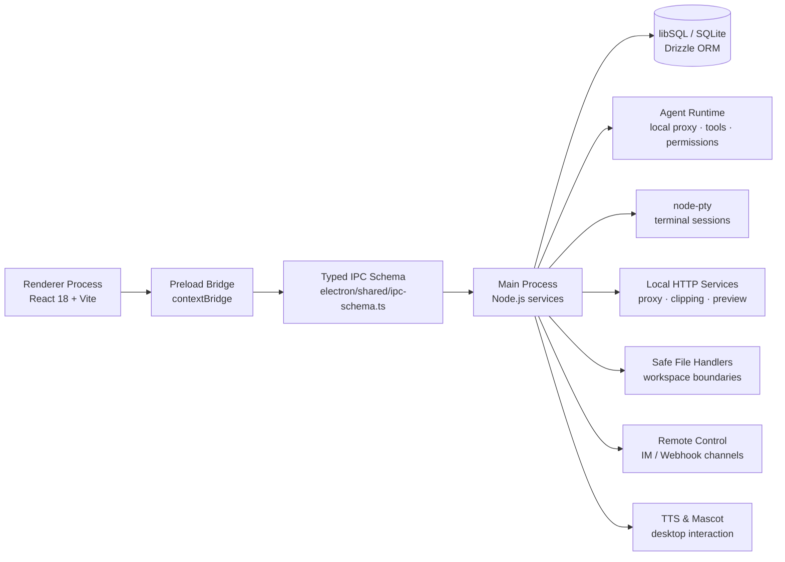

<h1 align="center">IPO Workbench</h1>

<p align="center">
  <strong>A local-first desktop workbench for AI agents, knowledge management, reading, coding, terminal workflows, remote control, and desktop interaction.</strong>
</p>

<p align="center">
  
  <a href="LICENSE"></a>
  
  
  
  
</p>

<p align="center">
  <a href="README_zh.md">中文文档</a> ·
  <a href="#overview">Overview</a> ·
  <a href="#features">Features</a> ·
  <a href="#architecture">Architecture</a> ·
  <a href="#quick-start">Quick Start</a> ·
  <a href="#documentation">Documentation</a> ·
  <a href="#development">Development</a>
</p>

---

<a id="overview"></a>

## Overview

IPO Workbench is a **local-first desktop AI workbench**. It is not just a chat client, a knowledge base, or an IDE. It brings the surfaces that AI work usually scatters across tools into one Electron desktop application:

- **Copilot** — agent conversations, tool calls, permission cards, plans, memory, MCP, sub-agents, and artifacts.
- **Knowledge workspace** — sources, notes, chunks, full-text search, embeddings, wiki pages, and knowledge cards.
- **Reader** — long-form materials, reading progress, highlights, bookmarks, and reusable knowledge capture.
- **Sandbox** — managed files, Monaco editor, safe file operations, preview server, execution graphs, and worktrees.
- **Terminal** — xterm.js + node-pty terminal sessions, bridgeable to agent and remote workflows.
- **Remote control** — connect IM and webhook channels (Feishu, Telegram, Slack, Discord, etc.) to desktop agent and terminal.
- **TTS & Mascot** — provider voices, streaming speech, reader integration, and a separate desktop companion window.
- **Local-first data layer** — local database and files, with optional WebDAV sync.

The product goal is to make **knowledge input, reading, agent execution, coding, terminal work, remote control, and artifact capture** share the same local workspace.

→ [Project Overview](docs/handbook/en/project-overview.md) · [Feature Catalog](docs/handbook/en/features.md)

---

<a id="features"></a>

## Features

| Capability | What it does | Deep dive |
|---|---|---|
| AI Agent / Copilot | Runs agent conversations, streams tool events, handles permissions, plans, memory, MCP, sub-agents, and artifacts | [Agent System](docs/handbook/en/agent-system.md) |
| Knowledge Base | Organizes sources, notes, chunks, full-text search, embeddings, wiki pages, and cards | [Knowledge & Reader](docs/handbook/en/knowledge-reader.md) |
| Reader | Reads long-form materials; turns highlights, bookmarks, and notes into reusable context | [Knowledge & Reader](docs/handbook/en/knowledge-reader.md) |
| Sandbox | Managed files, Monaco editing, safe file ops, preview server, execution graphs, worktrees | [Sandbox & Terminal](docs/handbook/en/sandbox-terminal.md) |
| Terminal | xterm.js + node-pty sessions bridgeable to agent and remote workflows | [Sandbox & Terminal](docs/handbook/en/sandbox-terminal.md) |
| Remote Control | IM/webhook channels connected to desktop agent and terminal with pairing and scopes | [Remote Control](docs/handbook/en/remote-control.md) |
| TTS & Mascot | Provider voices, streaming speech, reader integration, desktop mascot window | [TTS & Mascot](docs/handbook/en/tts-mascot.md) |
| Sync & Backup | WebDAV and local backup for local-first data | [Build & Release](docs/handbook/en/build-release.md) |

→ [Full Feature Catalog](docs/handbook/en/features.md)

---

<a id="architecture"></a>

## Architecture

IPO Workbench uses Electron's multi-process model. **Preload + typed IPC** is the central engineering boundary — the renderer never directly accesses Node.js system capabilities.



| Boundary | Path | Role |
|---|---|---|
| Renderer entry | [`src/main.tsx`](src/main.tsx) | Main app + `#/pet` mascot route |
| Main UI shell | [`src/App.tsx`](src/App.tsx) | Three-panel shell, reader, terminal, settings, command palette |
| Main process entry | [`electron/main/index.ts`](electron/main/index.ts) | Crash handlers, build paths, special launch modes, bootstrap |
| App lifecycle | [`electron/main/app-lifecycle.ts`](electron/main/app-lifecycle.ts) | Single-instance lock, database, IPC, windows, services |
| Preload bridge | [`electron/preload/index.ts`](electron/preload/index.ts) | Controlled APIs via `contextBridge` |
| IPC schema | [`electron/shared/ipc-schema.ts`](electron/shared/ipc-schema.ts) | Central command input/output contract |
| IPC registration | [`electron/main/ipc/register.ts`](electron/main/ipc/register.ts) | Centralized domain handler registration |
| Build config | [`vite.config.ts`](vite.config.ts) · [`electron-builder.json5`](electron-builder.json5) | Vite, Electron Builder, native packaging |

→ [Architecture](docs/handbook/en/architecture.md) · [API & IPC](docs/handbook/en/api-and-ipc.md)

---

<a id="tech-stack"></a>

## Tech Stack

| Layer | Technologies |
|---|---|
| Desktop runtime | Electron 40 |
| Renderer | React 18.3.1 · TypeScript 5.9 · Vite 7 |
| UI / Editor / Terminal | Monaco Editor · xterm.js · React Resizable Panels · lucide-react |
| Graph / Flow | `@xyflow/react` · D3 modules · Mermaid |
| Database | `@libsql/client` · Drizzle ORM · Drizzle Kit |
| Agent runtime | `@anthropic-ai/claude-agent-sdk` · local Anthropic-compatible proxy · MCP |
| Local services | Express · WebSocket · HTTP proxy middleware |
| Reader / parsing | React PDF · pdf-parse · Mammoth · Mozilla Readability · jsdom |
| Native modules | `node-pty` · `sharp` · libSQL platform packages |
| Sync / backup | WebDAV |
| Packaging | vite-plugin-electron · Electron Builder |
| Quality | TypeScript · Biome |

---

<a id="quick-start"></a>

## Quick Start

### Requirements

- Node.js and npm compatible with the current Electron / Vite / TypeScript toolchain.
- Native build tools for the target platform (needed for `node-pty`).
- Electron Builder environment and signing config for macOS / Windows installers.

### Install

```bash
npm install
```

`postinstall` automatically rebuilds `node-pty` and copies PDF.js assets.

### Start development mode

```bash
npm run dev
```

### Typecheck and lint

```bash
npm run typecheck
npm run lint
```

### Build

```bash
# Production build + package
npm run build

# Platform-specific
npm run build:mac        # macOS arm64
npm run build:mac:x64    # macOS x64 (verified)
npm run build:win        # Windows NSIS installer
npm run build:all        # macOS + Windows
```

→ [Quick Start guide](docs/handbook/en/quick-start.md) · [Build & Release](docs/handbook/en/build-release.md)

---

<a id="documentation"></a>

## Documentation

IPO Workbench uses a large-project documentation structure: this README is the front door, handbook pages explain each topic in depth.

```
README.md                      ← you are here (English)
README_zh.md                   ← 中文入口
docs/handbook/en/              ← English handbook (detailed)
docs/handbook/                 ← 中文手册 (详细)
ARCHITECTURE.md / API.md / FEATURES.md / DEVELOPMENT.md   ← root references
```

### English handbook

| Document | What it covers |
|---|---|
| [Handbook Home](docs/handbook/en/README.md) | Navigation, reading paths, maintenance rules |
| [Project Overview](docs/handbook/en/project-overview.md) | Positioning, user scenarios, product shape, capability map |
| [Architecture](docs/handbook/en/architecture.md) | Electron process model, startup sequence, IPC, services, boundaries |
| [Feature Catalog](docs/handbook/en/features.md) | Full capability map with paths and notes |
| [Quick Start](docs/handbook/en/quick-start.md) | Environment, install, dev startup, first provider, troubleshooting |
| [Development Guide](docs/handbook/en/development.md) | Directory conventions, IPC extension, UI, database, quality checks |
| [Agent System](docs/handbook/en/agent-system.md) | Agent runtime chain, tools, permissions, memory, MCP, sub-agents |
| [Knowledge & Reader](docs/handbook/en/knowledge-reader.md) | Sources, notes, wiki, cards, reader, highlights, retrieval |
| [Sandbox & Terminal](docs/handbook/en/sandbox-terminal.md) | Managed workspace, file tree, Monaco, xterm, previews, worktrees |
| [Remote Control](docs/handbook/en/remote-control.md) | Channels, pairing, scopes, message bridges, remote terminal |
| [TTS & Mascot](docs/handbook/en/tts-mascot.md) | Voice providers, streaming speech, mascot window and packages |
| [API & IPC](docs/handbook/en/api-and-ipc.md) | IPC contracts, handler patterns, events, local HTTP, security |
| [Build & Release](docs/handbook/en/build-release.md) | Build scripts, packaging, native modules, platform checks |
| [Documentation Map](docs/handbook/en/documentation-map.md) | How README, handbook, root refs, and historical docs fit together |

### Chinese documentation → [中文文档](README_zh.md)

---

<a id="development"></a>

## Development

### Scripts

| Command | Purpose |
|---|---|
| `npm run dev` | Start Vite + Electron development mode |
| `npm run typecheck` | TypeScript no-emit check |
| `npm run lint` | Biome checks |
| `npm run format` | Format source and config files |
| `npm run build` | Full production build and package |
| `npm run build:mac` | macOS arm64 |
| `npm run build:mac:x64` | macOS x64 (with native verification) |
| `npm run build:win` | Windows NSIS installer |
| `npm run build:all` | macOS + Windows |

### Recommended reading order

1. [Project Overview](docs/handbook/en/project-overview.md) — understand product boundaries.
2. [Architecture](docs/handbook/en/architecture.md) — understand main / preload / renderer and IPC boundaries.
3. [API & IPC](docs/handbook/en/api-and-ipc.md) — before adding any cross-process behavior.
4. [Development Guide](docs/handbook/en/development.md) — conventions for UI, state, database, and services.
5. [Build & Release](docs/handbook/en/build-release.md) — before packaging.

→ [Full Development Guide](docs/handbook/en/development.md)

---

<a id="project-structure"></a>

## Project Structure

```
.
├── electron/
│   ├── main/          # Main process: services, IPC handlers, windows, database, runtimes
│   ├── preload/       # Safe bridge exposed via contextBridge
│   └── shared/        # IPC schema, preload API, shared contracts
├── src/
│   ├── bootstrap/     # Main app and mascot app bootstrap
│   ├── components/    # UI components and feature panels
│   ├── lib/           # Renderer adapters, stores, domain utilities
│   └── pet/           # Desktop mascot renderer app
├── docs/
│   └── handbook/      # Structured handbook (en/ for English)
├── scripts/           # Build, asset copy, verification scripts
├── build/             # Electron Builder assets and icons
├── ARCHITECTURE.md
├── API.md
├── FEATURES.md
├── DEVELOPMENT.md
├── electron-builder.json5
├── vite.config.ts
└── package.json
```

---

## Design Principles

- **Local-first by default** — data, files, settings, and execution context stay local; external sync is optional.
- **Explicit process boundaries** — the renderer never directly accesses Node.js capabilities; preload + typed IPC is the only bridge.
- **Auditable tool use** — agent tool calls, file operations, terminal commands, and remote control flows should be visible, explainable, and confirmable.
- **Composable work surfaces** — chat, knowledge, reading, coding, terminal, browsing, and remote control are connected surfaces, not isolated pages.
- **Documentation follows code** — when old docs conflict with implementation, source code and structured handbook win.

## License

Licensed under the [Apache License 2.0](LICENSE).
