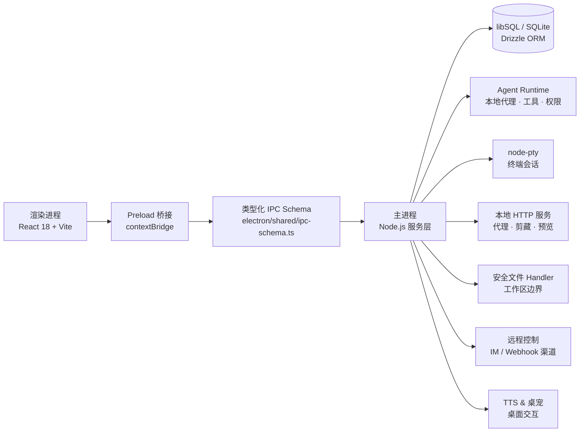

<h1 align="center">IPO Workbench</h1>

<p align="center">
  <strong>本地优先的桌面 AI 工作台，把 Agent、知识库、阅读、代码沙盒、终端、远程控制与桌面交互整合到一起。</strong>
</p>

<p align="center">
  
  <a href="LICENSE"></a>
  
  
  
  
</p>

<p align="center">
  <a href="README.md">English</a> ·
  <a href="#项目简介">项目简介</a> ·
  <a href="#核心能力">核心能力</a> ·
  <a href="#架构速览">架构速览</a> ·
  <a href="#快速开始">快速开始</a> ·
  <a href="#文档导航">文档导航</a> ·
  <a href="#开发参考">开发参考</a>
</p>

---

<a id="项目简介"></a>

## 项目简介

IPO Workbench 是一款**本地优先的桌面 AI 工作台**。它不是单纯的聊天客户端，也不是单纯的笔记工具或 IDE，而是把 AI 工作中经常割裂的几个界面统一到一个 Electron 桌面应用里：

- **Copilot**：Agent 对话、工具调用、权限卡片、计划模式、记忆、MCP、子 Agent 和产物渲染。
- **知识工作区**：资料（Sources）、笔记（Notes）、分块（Chunks）、全文检索、向量检索、Wiki 和知识卡片。
- **阅读器**：长文档阅读、进度、高亮、书签，以及把标注转化为可复用知识的流程。
- **代码沙盒**：托管文件树、Monaco 编辑器、安全文件操作、前端预览服务、执行图和 worktree。
- **终端**：xterm.js + node-pty 本地终端，可与 Agent 和远程控制桥接。
- **远程控制**：Feishu、Telegram、Slack、Discord 等渠道接入桌面 Agent 和终端。
- **TTS 与桌宠**：多 Provider 语音、流式朗读、阅读器联动，以及独立桌面宠物窗口。
- **本地优先数据层**：本地数据库 + 本地文件为主，可选 WebDAV 同步备份。

核心目标：让**知识输入、阅读理解、AI 执行、代码操作、终端运行、远程控制和产物沉淀**共享同一个本地工作台。

→ [项目总览](docs/handbook/project-overview.md) · [功能全景](docs/handbook/features.md)

---

<a id="核心能力"></a>

## 核心能力

| 能力 | 说明 | 深入文档 |
|---|---|---|
| AI Agent / Copilot | 运行 Agent 对话、流式展示工具事件、处理权限审批、计划模式、记忆、MCP、子 Agent 和产物 | [Agent 系统](docs/handbook/agent-system.md) |
| 知识库 | 管理 Sources、Notes、Chunks、全文检索、向量检索、Wiki 页面和知识卡片 | [知识库与阅读器](docs/handbook/knowledge-reader.md) |
| 阅读器 | 读取长文档，把高亮、书签、笔记转化为可复用知识 | [知识库与阅读器](docs/handbook/knowledge-reader.md) |
| 代码沙盒 | 托管文件树、Monaco 编辑器、安全文件 handler、预览服务、执行图和 worktree | [沙盒与终端](docs/handbook/sandbox-terminal.md) |
| 终端 | xterm.js + node-pty 本地终端，可桥接 Agent 和远程控制 | [沙盒与终端](docs/handbook/sandbox-terminal.md) |
| 远程控制 | IM / Webhook 渠道接入桌面 Agent 和终端，支持配对和权限范围 | [远程控制](docs/handbook/remote-control.md) |
| TTS 与桌宠 | 多 Provider 语音、流式朗读、阅读器联动、独立桌宠窗口和自定义 mascot 包 | [TTS 与桌宠](docs/handbook/tts-mascot.md) |
| 同步与备份 | WebDAV 和本地备份支持本地优先数据 | [构建与发布](docs/handbook/build-release.md) |

→ [完整功能全景](docs/handbook/features.md)

---

<a id="架构速览"></a>

## 架构速览

IPO Workbench 采用 Electron 多进程架构，**preload + 类型化 IPC** 是最核心的工程边界——渲染进程从不直接访问 Node.js 系统能力。



| 边界 | 关键路径 | 说明 |
|---|---|---|
| 渲染入口 | [`src/main.tsx`](src/main.tsx) | 主应用 + `#/pet` 桌宠路由 |
| 主 UI Shell | [`src/App.tsx`](src/App.tsx) | 三栏工作台、阅读器、终端、设置、命令面板 |
| 主进程入口 | [`electron/main/index.ts`](electron/main/index.ts) | crash handler、构建路径、特殊启动参数、bootstrap |
| 应用生命周期 | [`electron/main/app-lifecycle.ts`](electron/main/app-lifecycle.ts) | 单实例锁、数据库、IPC、窗口和后台服务 |
| Preload 桥接 | [`electron/preload/index.ts`](electron/preload/index.ts) | 通过 `contextBridge` 暴露受控 API |
| IPC Schema | [`electron/shared/ipc-schema.ts`](electron/shared/ipc-schema.ts) | 命令输入/输出类型契约 |
| IPC 注册 | [`electron/main/ipc/register.ts`](electron/main/ipc/register.ts) | 集中注册各领域 handler |
| 构建配置 | [`vite.config.ts`](vite.config.ts) · [`electron-builder.json5`](electron-builder.json5) | Vite、Electron Builder、原生模块打包 |

→ [系统架构](docs/handbook/architecture.md) · [API 与 IPC](docs/handbook/api-and-ipc.md)

---

<a id="技术栈"></a>

## 技术栈

| 层级 | 技术 |
|---|---|
| 桌面运行时 | Electron 40 |
| 渲染层 | React 18.3.1 · TypeScript 5.9 · Vite 7 |
| UI / 编辑器 / 终端 | Monaco Editor · xterm.js · React Resizable Panels · lucide-react |
| 图谱 / 流程 | `@xyflow/react` · D3 modules · Mermaid |
| 数据库 | `@libsql/client` · Drizzle ORM · Drizzle Kit |
| Agent 运行时 | `@anthropic-ai/claude-agent-sdk` · 本地 Anthropic 兼容代理 · MCP |
| 本地服务 | Express · WebSocket · HTTP proxy middleware |
| 阅读 / 文档解析 | React PDF · pdf-parse · Mammoth · Mozilla Readability · jsdom |
| 原生模块 | `node-pty` · `sharp` · libSQL 平台包 |
| 同步备份 | WebDAV |
| 打包发布 | vite-plugin-electron · Electron Builder |
| 质量工具 | TypeScript · Biome |

---

<a id="快速开始"></a>

## 快速开始

### 环境要求

- Node.js 和 npm（版本与当前 Electron / Vite / TypeScript 工具链匹配）。
- 目标平台的原生模块编译工具（`node-pty` 需要）。
- 构建 macOS / Windows 安装包时需要 Electron Builder 环境和签名配置。

### 安装依赖

```bash
npm install
```

`postinstall` 会自动重建 `node-pty` 并复制 PDF.js 资源。

### 启动开发模式

```bash
npm run dev
```

### 类型检查与代码检查

```bash
npm run typecheck
npm run lint
```

### 构建

```bash
# 完整构建 + 打包
npm run build

# 平台专项构建
npm run build:mac        # macOS arm64
npm run build:mac:x64    # macOS x64（含架构校验）
npm run build:win        # Windows NSIS 安装包
npm run build:all        # macOS + Windows
```

→ [快速开始详细指南](docs/handbook/quick-start.md) · [构建与发布](docs/handbook/build-release.md)

---

<a id="文档导航"></a>

## 文档导航

```
README.md          ← 英文入口（默认）
README_zh.md       ← 当前页（中文入口）
docs/handbook/     ← 中文结构化手册（详细）
docs/handbook/en/  ← English handbook (detailed)
```

| 文档 | 适合谁读 | 内容 |
|---|---|---|
| [Handbook 首页](docs/handbook/README.md) | 所有人 | 文档导航、推荐阅读路线、维护约定 |
| [项目总览](docs/handbook/project-overview.md) | 新用户、评审者、产品/设计 | 产品定位、用户场景、能力边界、工作台形态 |
| [系统架构](docs/handbook/architecture.md) | 架构师、核心开发者 | 进程模型、启动链路、IPC、数据层、服务层和安全边界 |
| [功能全景](docs/handbook/features.md) | 用户、产品、开发者 | Agent、知识库、阅读器、沙盒、远程控制、TTS、桌宠完整地图 |
| [快速开始](docs/handbook/quick-start.md) | 第一次运行项目的人 | 环境准备、安装、开发启动、首个 Provider 配置、常见问题 |
| [开发指南](docs/handbook/development.md) | 贡献者、维护者 | 目录约定、IPC 扩展、UI 开发、状态管理、数据库、质量检查 |
| [Agent 系统](docs/handbook/agent-system.md) | AI 能力开发者 | Agent 运行链路、工具调用、权限、记忆、MCP、子代理 |
| [知识库与阅读器](docs/handbook/knowledge-reader.md) | 知识/阅读器开发者 | Sources、Notes、Wiki、Cards、Reader、标注、检索 |
| [沙盒与终端](docs/handbook/sandbox-terminal.md) | 代码工作区开发者 | 文件树、Monaco、xterm、预览服务、执行图、worktree |
| [远程控制](docs/handbook/remote-control.md) | IM / Webhook 集成开发者 | 渠道、配对、权限、消息桥接、远程终端 |
| [TTS 与桌宠](docs/handbook/tts-mascot.md) | 多媒体与桌面交互开发者 | TTS Provider、语音合成、桌宠窗口、自定义 mascot 包 |
| [API 与 IPC](docs/handbook/api-and-ipc.md) | 前后端联调者 | IPC 契约、handler 模式、事件推送、本地 HTTP、安全边界 |
| [构建与发布](docs/handbook/build-release.md) | Release 负责人 | 构建脚本、打包配置、原生依赖、发布前检查 |
| [文档地图](docs/handbook/documentation-map.md) | 文档维护者 | 根文档、handbook、历史文档如何归档和引用 |

> 当历史文档与当前代码、`package.json` 或 handbook 冲突时，优先以源代码和 handbook 为准。

---

<a id="开发参考"></a>

## 开发参考

### 常用命令

| 命令 | 说明 |
|---|---|
| `npm run dev` | 启动 Vite + Electron 开发模式 |
| `npm run typecheck` | TypeScript no-emit 类型检查 |
| `npm run lint` | Biome 代码检查 |
| `npm run format` | 格式化源码和配置文件 |
| `npm run build` | 完整生产构建 + 打包 |

### 推荐开发路线

1. [项目总览](docs/handbook/project-overview.md)：理解产品边界和工作台形态。
2. [系统架构](docs/handbook/architecture.md)：理解 main / preload / renderer 和 IPC 边界。
3. [API 与 IPC](docs/handbook/api-and-ipc.md)：新增跨进程能力前必读。
4. [开发指南](docs/handbook/development.md)：目录约定、UI、状态、数据库、服务层规范。
5. [构建与发布](docs/handbook/build-release.md)：打包前必读。

→ [完整开发指南](docs/handbook/development.md)

---

## 设计原则

- **本地优先**：数据、文件、设置和运行上下文默认留在本地；外部同步是可选能力。
- **显式进程边界**：渲染进程不直接持有系统能力；preload + 类型化 IPC 是唯一桥梁。
- **可审计的工具使用**：Agent 工具调用、文件操作、终端执行和远程控制都应当可见、可解释、可确认。
- **可组合的工作表面**：对话、知识、阅读、代码、终端、浏览和远程控制是相互流转的工作表面，而不是孤立页面。
- **文档跟随代码**：旧文档与实现冲突时，以源代码和 handbook 为准。

## 许可证

基于 [Apache License 2.0](LICENSE) 开源。
